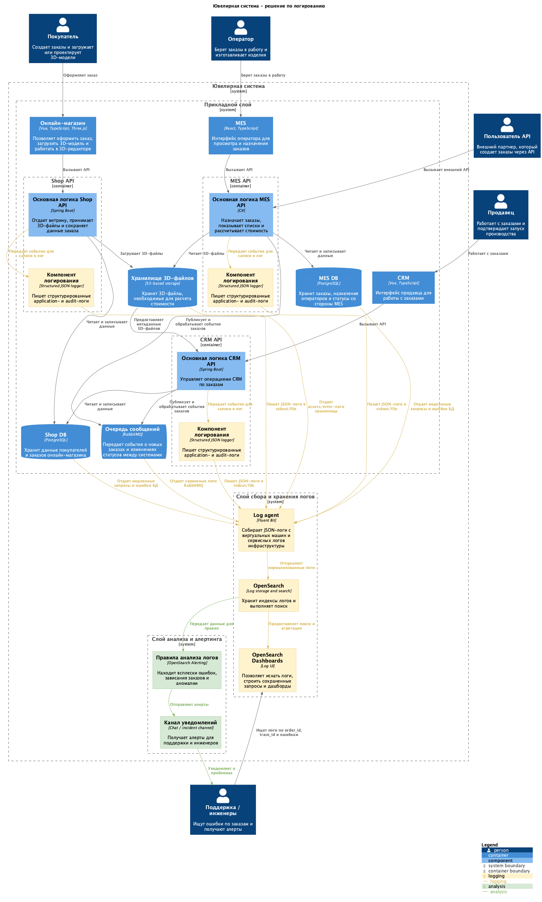

# Архитектурное решение по логированию

## Системы, из которых нужно собирать логи

1. **Shop API.**

   Создание заказа, загрузка 3D-файла и передача заказа дальше начинаются здесь. Если заказ не дошел до MES или CRM, первое место проверки - логи Shop API.

2. **CRM API.**

   CRM участвует в подтверждении производства, работе продавцов и обмене событиями с MES. Логи CRM API помогут понять, был ли заказ подтвержден, кто выполнил действие и не возникла ли ошибка при публикации события.

3. **MES API.**

   MES API нужно логировать расчет стоимости, работа операторов, производственные статусы и B2B API. 

4. **RabbitMQ.**

   Нужно собирать сервисные логи очереди и логи публикации/обработки сообщений в приложениях.

5. **Shop DB и MES DB.**

   Нужны логи ошибок БД, медленных запросов и проблем с подключениями. Логировать все SQL-запросы не нужно: это дорого и может раскрыть чувствительные данные.

6. **S3-хранилище 3D-файлов.**

   Нужны access/error-логи операций загрузки и чтения 3D-файлов. Это поможет диагностировать ситуации, когда расчет стоимости не может получить файл.

7. **Frontend-приложения: онлайн-магазин, CRM, MES.**

   На первом этапе достаточно собирать только ошибки клиентских приложений и ключевые пользовательские действия, связанные с заказом. Полное логирование действий в браузере может создать слишком много шума и рисков по персональным данным.

## Общий формат логов

Все сервисы должны писать структурированные JSON-логи. Общие поля:

| Поле          | Описание                                                                         |
| ------------- | -------------------------------------------------------------------------------- |
| `timestamp`   | Время события в UTC.                                                             |
| `level`       | Уровень логирования: INFO, WARN, ERROR и так далее.                              |
| `service`     | Имя сервиса: `shop-api`, `crm-api`, `mes-api`.                                   |
| `environment` | Окружение: dev, release, prod.                                                   |
| `version`     | Версия приложения или сборки.                                                    |
| `message`     | Короткое описание события.                                                       |
| `order_id`    | Идентификатор заказа, если событие связано с заказом.                            |
| `trace_id`    | Идентификатор trace для связи с трейсингом.                                      |
| `request_id`  | Идентификатор HTTP-запроса.                                                      |
| `user_role`   | Роль пользователя: customer, seller, operator, api_user.                         |
| `partner_id`  | Идентификатор партнера для B2B-сценариев.                                        |
| `operation`   | Тип операции: создание заказа, расчет цены, смена статуса, публикация сообщения. |
| `result`      | Результат операции: success, failure, skipped.                                   |
| `error_type`  | Класс или категория ошибки без чувствительных данных.                            |

## INFO-логи, которые нужно собирать

INFO-логи должны фиксировать значимые бизнес- и технические события без избыточных деталей payload.

| Система           | INFO-событие                            | Что логировать                                                                   |
| ----------------- | --------------------------------------- | -------------------------------------------------------------------------------- |
| Shop API          | Создание заказа                         | `order_id`, `customer_id_hash`, `channel=B2C`, начальный статус, `trace_id`.     |
| Shop API          | Загрузка 3D-файла                       | `order_id`, `file_id`, размер файла, формат, результат загрузки.                 |
| Shop API          | Отправка заказа на дальнейшую обработку | `order_id`, целевая система или очередь, результат операции.                     |
| CRM API           | Получение заказа или события по заказу  | `order_id`, источник события, текущий статус, `message_id`.                      |
| CRM API           | Подтверждение производства              | `order_id`, роль пользователя, предыдущий и новый статус, результат.             |
| CRM API           | Закрытие заказа                         | `order_id`, способ закрытия: вручную или по событию транспортной компании.       |
| MES API           | Получение B2B-заказа                    | `order_id`, `partner_id`, результат валидации запроса.                           |
| MES API           | Начало расчета стоимости                | `order_id`, `file_id`, источник заказа, базовая сложность модели, если доступна. |
| MES API           | Завершение расчета стоимости            | `order_id`, результат расчета, длительность, новый статус.                       |
| MES API           | Оператор взял заказ в работу            | `order_id`, `operator_id_hash`, предыдущий и новый статус.                       |
| MES API           | Изменение производственного статуса     | `order_id`, предыдущий статус, новый статус, роль пользователя.                  |
| MES API           | Упаковка и отправка заказа              | `order_id`, новый статус, результат операции.                                    |
| RabbitMQ          | Публикация сообщения                    | `message_id`, `order_id`, exchange, routing key, результат публикации.           |
| RabbitMQ consumer | Обработка сообщения                     | `message_id`, `order_id`, queue, consumer, результат обработки.                  |
| S3-хранилище      | Чтение или запись 3D-файла              | `file_id`, `order_id`, операция, результат.                                      |

## Уровни логирования

| Уровень          | Когда использовать                                                                                                                          |
| ---------------- | ------------------------------------------------------------------------------------------------------------------------------------------- |
| DEBUG            | Только временно в dev/release или для точечного разбора инцидента. В prod по умолчанию выключен, потому что быстро увеличивает объем логов. |
| INFO             | Нормальные бизнес- и технические события, по которым восстанавливается путь заказа.                                                         |
| WARN             | Ситуация не сломала сценарий, но требует внимания: повторная попытка, медленная операция, некритичная ошибка внешней зависимости.           |
| ERROR            | Операция не выполнена: заказ не сохранен, сообщение не обработано, расчет завершился ошибкой, файл недоступен.                              |
| FATAL / CRITICAL | Приложение не может продолжать работу или потеряло критичную зависимость. Используется для аварийных ситуаций.                              |

## Мотивация

Централизованное логирование сократит время диагностики проблемных заказов. Вместо ручного поиска по серверам и опроса клиента команда сможет открыть OpenSearch, найти `order_id` и увидеть события во всех сервисах.

Для бизнеса это даст:

- более быстрые ответы клиентам и партнерам по проблемным заказам;
- снижение нагрузки на поддержку и разработчиков;
- меньше заказов, которые долго находятся в непонятном состоянии;
- доказуемый разбор спорных B2B-сценариев;
- основу для алертов по ошибкам и аномалиям.

Метрики, на которые повлияет решение:

| Метрика                                         | Ожидаемое влияние                                                                             |
| ----------------------------------------------- | --------------------------------------------------------------------------------------------- |
| MTTR по инцидентам с заказами                   | Сократится за счет поиска событий по `order_id` и `trace_id`.                                 |
| Время ответа поддержки клиенту                  | Сократится, потому что поддержка увидит последние события заказа без запроса к разработчикам. |
| Количество повторных обращений по одному заказу | Должно снизиться за счет более точной диагностики с первого обращения.                        |
| Доля ошибок, найденных до жалобы клиента        | Должна вырасти после настройки алертов по логам.                                              |
| Количество ручных расследований на серверах     | Снизится, потому что логи будут доступны централизованно.                                     |

## Приоритет логирования и трейсинга

Команда не сможет одновременно внедрить и логирование, и трейсинг во всех системах. Приоритет такой:

| Приоритет | Система                          | Что внедрять первым                      | Почему                                                                                       |
| --------- | -------------------------------- | ---------------------------------------- | -------------------------------------------------------------------------------------------- |
| P0        | MES API                          | Логи и трейсинг                          | Самая критичная система: расчет стоимости, операторы, B2B API и производственные статусы.    |
| P0        | RabbitMQ и обработчики сообщений | Логи обработки сообщений и trace context | Заказ может потеряться между CRM и MES, поэтому нужно видеть публикацию и обработку событий. |
| P0        | CRM API                          | Логи и трейсинг ключевых операций        | CRM подтверждает производство и участвует в смене статусов.                                  |
| P1        | Shop API                         | Логи и трейсинг оформления заказа        | Важен вход заказа в систему и загрузка 3D-файла.                                             |
| P1        | S3-хранилище                     | Access/error-логи                        | Нужно видеть ошибки чтения и записи 3D-файлов.                                               |
| P2        | Frontend-приложения              | Ошибки UI и ключевые действия            | Полезно для диагностики, но менее критично, чем backend-путь заказа.                         |

## Предлагаемое решение

Для централизованного логирования предлагается использовать:

- structured JSON logging в приложениях;
- Fluent Bit как агент сбора логов на виртуальных машинах;
- OpenSearch как хранилище и поисковый движок;
- OpenSearch Dashboards как UI для поиска и дашбордов;
- OpenSearch Alerting для правил и уведомлений.

### Как будет работать сбор логов

1. `Shop API`, `CRM API` и `MES API` пишут структурированные JSON-логи в stdout.
2. Fluent Bit собирает application-логи с виртуальных машин и сервисные логи RabbitMQ, PostgreSQL и S3.
3. Fluent Bit нормализует поля, добавляет `environment`, `service`, `host`, `version` и отправляет записи в OpenSearch.
4. В OpenSearch создаются отдельные индексы по системам и окружениям.
5. Поддержка и разработчики ищут события через OpenSearch Dashboards.
6. Правила OpenSearch Alerting анализируют ошибки, всплески и подозрительные последовательности.

### Схема решения

Новая схема в PlantUML:

- [jewerly_c4_model_logging_solution.puml](jewerly_c4_model_logging_solution.puml)
- 

На схеме желтым выделены элементы сбора и хранения логов, зеленым - элементы анализа и алертинга. Компоненты логирования показаны внутри `Shop API`, `CRM API` и `MES API`, потому что логгер является частью приложения, а не отдельным сервисом.

## Политика безопасности логов

1. **Запрет на чувствительные данные.**

   В логи нельзя писать ФИО, телефон, email, адрес доставки, платежные данные, полный payload заказа, содержимое 3D-файла и токены авторизации.

2. **Идентификаторы вместо персональных данных.**

   Для диагностики используются `order_id`, `file_id`, `partner_id`, `trace_id`, `request_id`. Если нужен пользовательский идентификатор, он должен быть хеширован или заменен техническим ID.

3. **Разграничение доступа.**

   Поддержка получает доступ к поиску по заказам и базовым событиям. Разработчики получают доступ к техническим ошибкам. Администраторы управляют индексами, retention policy и правами.

4. **Разделение окружений.**

   Логи prod, release и dev должны храниться в отдельных индексах или пространствах доступа. Доступ к prod-логам должен быть строже, чем к dev/release.

5. **Аудит доступа.**

   Доступ к OpenSearch Dashboards и административные действия должны логироваться. Это важно, потому что даже очищенные логи могут содержать чувствительный контекст.

## Политика хранения логов

Индексы предлагается разделить по системам и окружениям:

- `logs-shop-api-prod-*`;
- `logs-crm-api-prod-*`;
- `logs-mes-api-prod-*`;
- `logs-rabbitmq-prod-*`;
- `logs-db-prod-*`;
- `logs-s3-prod-*`;
- аналогичные индексы для `release` и `dev`.

Retention policy:

| Тип логов           | Срок хранения | Причина                                                                  |
| ------------------- | ------------- | ------------------------------------------------------------------------ |
| ERROR/WARN в prod   | 90 дней       | Нужны для расследования инцидентов и повторяющихся проблем.              |
| INFO в prod         | 30 дней       | Достаточно для разбора клиентских обращений и свежих проблемных заказов. |
| Security/audit logs | 180 дней      | Нужны для расследования доступа и спорных действий.                      |
| Dev/release logs    | 14 дней       | Используются для отладки и не должны занимать много места.               |

Дополнительно:

- настроить rollover индексов по размеру или времени;
- включить сжатие старых индексов;
- завести алерт на заполнение хранилища логов;
- не хранить DEBUG-логи в prod постоянно.

## Анализ логов, алертинг и аномалии

### Алерты

Нужно настроить алерты:

- рост `ERROR` в `MES API`;
- ошибки расчета стоимости;
- ошибки чтения 3D-файлов из S3;
- ошибки публикации или обработки сообщений RabbitMQ;
- частые HTTP 500 по Shop API, CRM API, MES API;
- заказ долго не меняет статус после ключевого события;
- резкий рост B2B-запросов или ошибок по одному `partner_id`;
- недоступность OpenSearch или остановка Fluent Bit.

### Поиск аномалий

Полезные аномалии:

- число созданных заказов резко выросло за короткое время;
- один партнер отправляет необычно много запросов;
- резко выросло количество ошибок валидации 3D-файлов;
- операторы массово получают ошибки при взятии заказа в работу;
- появилось много повторных обработок одного и того же сообщения;
- размер логов по сервису вырос сильнее обычного, что может означать цикл ошибок.

При критичных алертах уведомление должно идти в рабочий чат поддержки и инженерной команды. Для high/highest-инцидентов нужен отдельный incident channel и назначенный ответственный.

Алерты из мониторинга, трейсинга и логирования должны маршрутизироваться в единый incident channel с одинаковыми правилами критичности. Это не дает ситуации, когда Prometheus/Alertmanager, trace-derived alerts и OpenSearch Alerting создают три независимых процесса реагирования.

## Выбор технологии

В качестве основного решения выбираем **OpenSearch + OpenSearch Dashboards + Fluent Bit**.

| Критерий                            | OpenSearch                                                           | ELK / Elastic Stack                                                              | Grafana Loki                                                                               | Splunk                                              |
| ----------------------------------- | -------------------------------------------------------------------- | -------------------------------------------------------------------------------- | ------------------------------------------------------------------------------------------ | --------------------------------------------------- |
| Лицензия и стоимость                | Открытая экосистема, можно использовать без лицензии Splunk/Elastic. | Есть ограничения Elastic License, коммерческие функции могут требовать подписки. | Открытая экосистема, обычно дешевле для больших объемов.                                   | Проприетарный продукт, высокая стоимость.           |
| Поиск по тексту и полям             | Сильный полнотекстовый и структурный поиск.                          | Сильный полнотекстовый и структурный поиск.                                      | Лучше подходит для label-based поиска, полнотекстовый анализ слабее OpenSearch/Elastic.    | Очень сильный поиск и аналитика.                    |
| Алертинг                            | Есть OpenSearch Alerting.                                            | Есть в Elastic Stack, часть возможностей зависит от лицензии.                    | Нужна связка с Grafana Alerting.                                                           | Сильный встроенный алертинг.                        |
| Простота внедрения                  | Хорошо подходит для JSON-логов и привычной ELK-подобной модели.      | Зрелая экосистема, но возможны лицензионные ограничения.                         | Простая связка с Grafana, особенно если Grafana уже используется.                          | Мощный, но тяжелый и дорогой для небольшой команды. |
| Работа со структурированными логами | Подходит хорошо: индексы, mappings, поля, агрегации.                 | Подходит хорошо.                                                                 | Подходит, но требует аккуратной работы с labels, чтобы не получить высокую кардинальность. | Подходит отлично.                                   |
| Эксплуатация командой               | Понятный компромисс между возможностями и сложностью.                | Похоже на OpenSearch, но лицензионно сложнее.                                    | Проще хранить большие объемы, но сложнее делать глубокую аналитику по полям.               | Требует бюджета и отдельной экспертизы.             |

**Вывод:** OpenSearch лучше всего подходит для текущей задачи, потому что компании нужен поиск по `order_id`, `trace_id`, `partner_id`, сервису, статусу и ошибкам. Loki можно рассмотреть позже, если основной проблемой станет стоимость хранения большого объема логов, а не глубина поиска и анализа.
