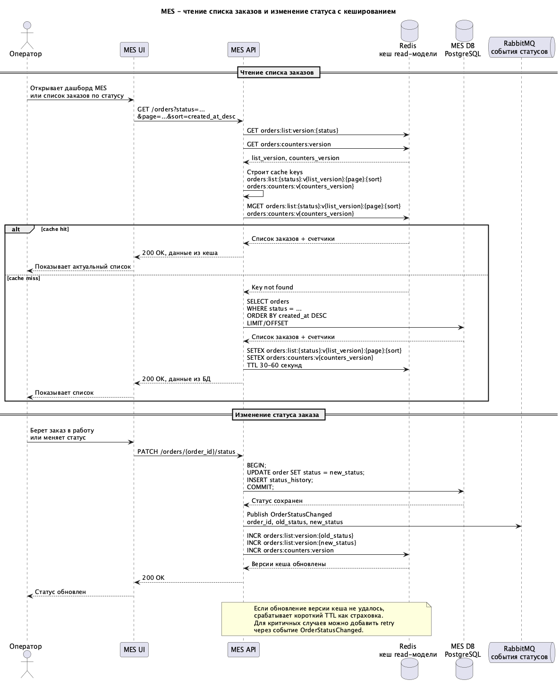

# Архитектурное решение по кешированию

## Контекст

Основная жалоба операторов связана с первой страницей MES: список заказов в работе по статусам и фильтрам загружается медленно. Команда уже добавила фильтр по статусу и пагинацию, но это не решило проблему. Значит, узкое место, вероятнее всего, находится не только в объеме ответа, но и в чтении из `MES DB`: сортировка новых заказов, счетчики по статусам, индексы, агрегации или конкуренция чтения с записью производственных статусов.

Кеширование в этом задании стоит применять к read-сценариям MES, а не к основному workflow заказа. Статус заказа должен сохраняться в БД как источник истины, а кеш должен ускорять чтение операторского интерфейса.

## Что кешировать

Кешировать имеет смысл данные, которые часто читаются и не требуют строгой консистентности.

| Область | Кешировать? | Решение |
| --- | --- | --- |
| Список заказов MES по статусу, странице и сортировке | Да | Операторы часто открывают один и тот же список новых/активных заказов. |
| Счетчики заказов по статусам для дашборда MES | Да | Данные часто читаются, пересчитывать агрегации в БД при каждом открытии страницы дорого. |
| Карточка отдельного заказа | Нет на первом этапе | Сейчас приоритетнее ускорить список заказов и счетчики дашборда MES. Кеширование карточки можно рассмотреть позже, если мониторинг покажет, что ее чтение тоже создает заметную нагрузку. |
| Результат расчета стоимости | Нет как основное решение | 3D-модели чаще уникальные, а цена может зависеть от актуальных правил, материалов и тарифов. Риск устаревшей цены выше ожидаемой пользы. |
| 3D-файлы | Нет | Их уже хранит S3-like storage. Для ускорения доступа лучше использовать настройки хранилища/CDN отдельно, а не кеш MES API. |
| Статусы заказа как источник истины | Нет | Статус должен храниться в `MES DB`, кеш может содержать только read-модель для отображения. |

## Мотивация

Кеширование нужно внедрить для ускорения операторского дашборда и снижения нагрузки на `MES DB`. Сейчас оператору важно быстро увидеть новые заказы, потому что от этого зависит взятие заказа в работу и вознаграждение.

Кеш должен решить следующие проблемы:

- ускорить открытие списка заказов по статусам;
- снизить количество повторяющихся тяжелых чтений из `MES DB`;
- уменьшить конкуренцию между чтением дашборда и записью производственных статусов;
- дать быстрый эффект без полной перестройки MES.

## Предлагаемое решение

### Тип кеширования

Предлагается внедрить **серверное кеширование** в `MES API` с использованием Redis.

Клиентское кеширование в браузере MES не подходит как основное решение:

- у операторов должна быть согласованная картина доступных заказов;
- разные операторы конкурируют за новые заказы;
- браузерный кеш сложнее инвалидировать при изменении статуса другим оператором;
- проблема находится не только в сети, но и в дорогом чтении/агрегациях на стороне backend и БД.

Серверный кеш лучше подходит, потому что `MES API` контролирует чтение, запись, инвалидацию и может обеспечить единые правила для всех операторов.

### Что добавляем в архитектуру

1. **Redis**

   Хранит read-кеш для списков заказов и счетчиков по статусам.

2. **Cache layer внутри MES API.**

   Отвечает за построение ключей, чтение из кеша, запись в кеш и актуализацию версий после изменения статуса.

3. **Версионирование ключей по событию изменения статуса.**

   После успешной записи статуса в `MES DB` `MES API` увеличивает версии кеша для старого и нового статуса заказа, а также версию счетчиков. Старые ключи остаются в Redis до истечения TTL и больше не используются новыми запросами.

### Паттерн кеширования

Выбранный паттерн: **Cache-Aside**.

Как работает чтение:

1. `MES API` получает запрос списка заказов.
2. Строит cache key: статус, страница, сортировка, размер страницы.
3. Проверяет Redis.
4. Если данные есть, возвращает их оператору.
5. Если данных нет, читает `MES DB`, кладет результат в Redis с TTL и возвращает ответ.

Как работает запись:

1. Оператор меняет статус заказа.
2. `MES API` сохраняет изменение в `MES DB`.
3. После успешного commit увеличивает версии кешей списков и счетчиков, которые могли устареть.
4. Следующий запрос снова построит актуальный кеш из БД.

### Почему Cache-Aside

| Паттерн       | Оценка                                                                                                                                                 |
| ------------- | ------------------------------------------------------------------------------------------------------------------------------------------------------ |
| Cache-Aside   | Лучше всего подходит для списков и дашбордов. БД остается источником истины, кеш заполняется только при чтении, а версии кеша обновляются после записи. |
| Write-Through | Хуже подходит: при каждой записи статуса нужно синхронно обновлять много вариантов списков, страниц и счетчиков.                                       |
| Refresh-Ahead | Может быть полезен позже для самых популярных списков, но как стартовое решение сложнее. Нужно заранее понимать ключи и расписание обновления.         |

## Диаграмма последовательности

Диаграмма показывает чтение списка заказов и запись изменения статуса с актуализацией кеша.

- [mes_orders_cache_sequence.puml](mes_orders_cache_sequence.puml)
- 

## Ключи кеша

Предлагаемый формат ключей:

| Данные                            | Ключ                                                        | TTL          |
| --------------------------------- | ----------------------------------------------------------- | ------------ |
| Версия списка заказов по статусу  | `orders:list:version:{status}`                              | Без TTL      |
| Список заказов по статусу         | `orders:list:{status}:v{version}:{page}:{page_size}:{sort}` | 30-60 секунд |
| Версия счетчиков по статусам      | `orders:counters:version`                                   | Без TTL      |
| Счетчики по статусам              | `orders:counters:v{version}`                                | 30-60 секунд |

TTL нужен для автоматической очистки старых версий read-кеша. Основной механизм актуализации - программное увеличение версии после записи.

## Стратегия инвалидации кеша

Основная стратегия: программное версионирование ключей после успешной записи в БД + короткий TTL для очистки старых данных.

При изменении статуса заказа:

1. `MES API` сохраняет новый статус в `MES DB`.
2. После успешного commit увеличивает:
   - `orders:list:version:{old_status}`;
   - `orders:list:version:{new_status}`;
   - `orders:counters:version`.
3. Следующие запросы строят ключи с новой версией и не читают устаревшие списки. Старые ключи удаляются автоматически по TTL.

Сравнение стратегий:

| Стратегия                     | Плюсы                                                                                              | Минусы                                                                                              | Решение                                          |
| ----------------------------- | -------------------------------------------------------------------------------------------------- | --------------------------------------------------------------------------------------------------- | ------------------------------------------------ |
| Только TTL                    | Просто реализовать.                                                                                | Оператор может видеть устаревший список до истечения TTL. При конкуренции операторов это неприятно. | Использовать только как запасной механизм.       |
| Инвалидация через `SCAN + DEL` | Можно удалить все ключи по шаблону без смены формата ключей.                                      | Сложнее контролировать нагрузку на Redis, при большом числе ключей удаление может стать дорогим.    | Не выбирать как основной подход.                 |
| Версионирование ключей        | Быстро переключает чтение на новую версию без wildcard-удаления. Старые ключи очищаются по TTL.    | Требует хранить и обновлять версии по статусам и счетчикам.                                         | Выбрать как основной подход.                     |
| Write-through обновление кеша | Может поддерживать кеш всегда заполненным.                                                         | Сложно обновлять все страницы, сортировки и счетчики при каждом изменении.                          | Не подходит для первого этапа.                   |
